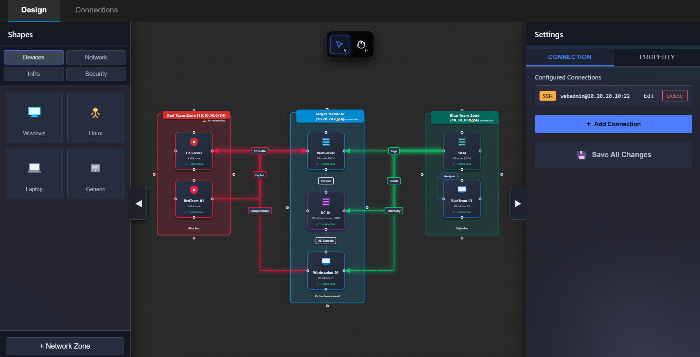
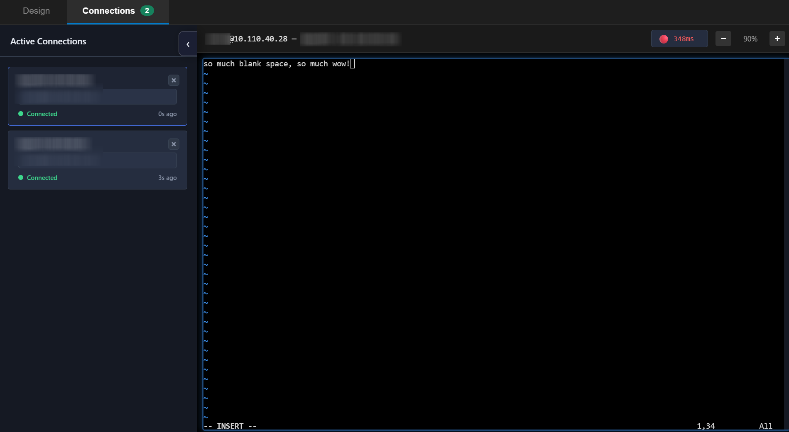

<div align="center">
  
  <h1>Archy</h1>
</div>

## Overview

**Archy** is a desktop application that combines network topology visualization with integrated remote access management. Born from the challenges of managing multiple virtual machines across various environments, Archy eliminates context-switching between diagram tools and credential managers.





## Core Features

### Visual Network Diagramming
- **Drag-and-drop interface** powered by React Flow
- **Device library** with 11+ pre-built icons (Router, Server, Firewall, Linux, Windows, Cloud, Database, etc.)
- **Custom edges** with multiple line styles, colors, and arrow types
- **Network zones** using colored group containers
- **Text annotations** for documentation

### Integrated Connection Management
- **Multiple protocols**: RDP, SSH, HTTP/HTTPS, custom commands
- **Built-in SSH terminal** using xterm.js with full PTY support
- **One-click connections** from diagram nodes
- **Credential storage** embedded in device nodes
- **Tab-based interface** for managing multiple simultaneous connections

### Productivity Tools
- **Undo/Redo** with 50-state history
- **Save/Load** diagrams with metadata
- **Export** to PNG, JPG, or SVG
- **Auto-save** last session
- **Context menus** for quick actions

## Installation & Development

```bash
# Install dependencies
npm install

# Build application
npm run build

# Start application
npm start

# Development mode
npm run dev

# Create distributable
npm run package
```
## Security Considerations

**Important**: Archy stores credentials in plain text locally for convenience in lab environments.

- Designed for **isolated lab networks** and **personal research environments**
- **Not recommended** for production infrastructure or shared systems
- Always use dedicated test credentials, never production passwords

## Use Cases

- **Red Team Operations**: Map attack surfaces and maintain access to compromised hosts
- **Penetration Testing**: Document network topology during engagements
- **Lab Management**: Track virtual machines across multiple Proxmox/ESXi hosts
- **Security Research**: Organize sandbox environments and tool deployments
- **Network Administration**: Quick-access dashboard for infrastructure management

## Contributing

Contributions welcome! Please open an issue or submit a pull request.
