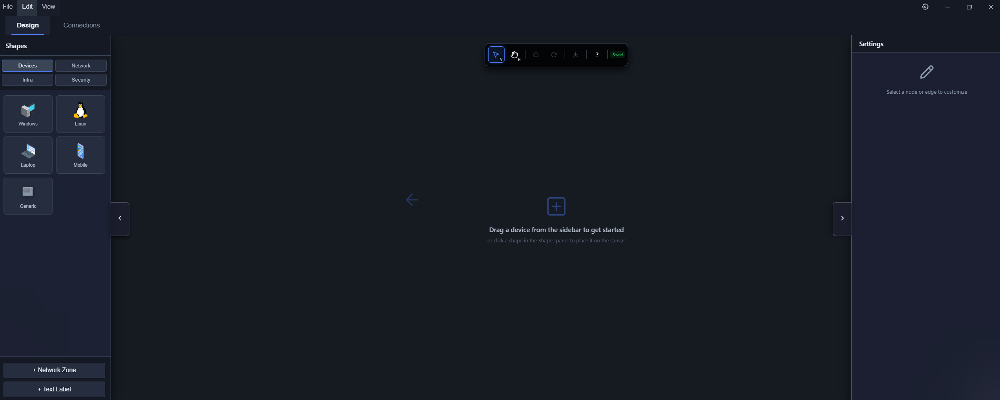
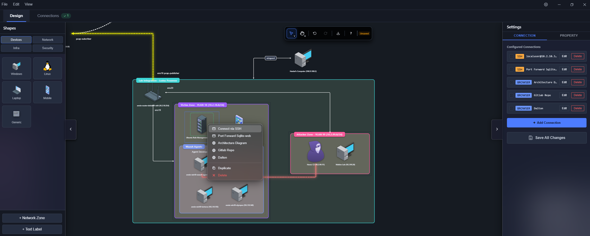
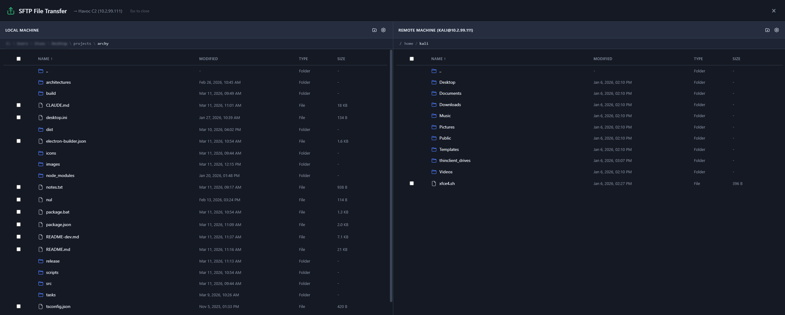

<div align="center">
  
</div>

# Archy – Visual Infrastructure + Remote Access in One Place
## Overview
Archy is a desktop application that combines network architecture visualization with built-in remote access tools.

In many real-world environments such as labs, pentest engagements, infrastructure operations, or homelabs—engineers often juggle several tools at once:
- a diagram tool to understand the infrastructure
- a credential list or spreadsheet with IPs and logins
- multiple terminal windows to connect to machines

Archy brings these pieces together into a single interactive workspace.

Instead of a static diagram, your network map becomes a working control panel. Devices on the diagram are not just icons—they can hold connection details, open SSH terminals, launch RDP sessions, or transfer files.

The result is a workflow where architecture, access, and operations all live in the same place.

## Architecture

Archy is built on **Electron** with a three-process architecture:

```
┌─────────────────────────────────────────────────────┐
│                   Main Process                       │
│  (Node.js — SSH sessions, file I/O, system access)  │
│                                                      │
│  ssh2 ──── SSH/SFTP connections                      │
│  node-pty ─ Local terminal sessions                  │
│  cmdkey ─── RDP credential injection (Windows)       │
│  electron-store ── Diagram/settings persistence      │
└──────────────────────┬──────────────────────────────┘
                       │ IPC (contextBridge)
┌──────────────────────┴──────────────────────────────┐
│                  Renderer Process                    │
│  (React — UI, diagram canvas, terminal emulator)     │
│                                                      │
│  React Flow ── Diagram canvas                        │
│  xterm.js ──── Terminal emulator (WebGL-accelerated) │
│  html-to-image ── Diagram export                     │
└─────────────────────────────────────────────────────┘
```
### Data Flow

- **Diagram data** is serialized as JSON (nodes, edges, viewport) and stored via electron-store
- **SSH terminal data** is buffered in the main process (4ms batching, 8KB chunks) and sent to the renderer via IPC with backpressure flow control
- **Credentials** are stored in plain text within node data inside electron-store (see [Security Considerations](#security-considerations))

## Key Capabilities

**Visual Infrastructure Designer** - Create network diagrams using a drag-and-drop canvas. Add devices like servers, routers, and firewalls, connect them visually, organize them into zones, and export diagrams as PNG, JPG, or SVG. 



**Integrated Remote Connections** - Each device node can store connection details (SSH, RDP, HTTP, or custom commands). Launch sessions directly from the diagram without copying IPs or searching for credentials. 



**Built-in Multi-Terminal Sessions** - Run multiple SSH sessions inside Archy using an integrated terminal powered by **xterm.js**, with tabbed sessions and full PTY support. 


**SFTP File Transfer** - Transfer files between local and remote systems using a dual-pane SFTP browser for uploads, downloads, and directory management. 



## Installation

### From Installer

> **Note:** The current installer has only been tested on **Windows**.

Run `Archy-Setup-<version>.exe`:

- Single-click install, no administrator privileges required  
- Installs to `%LOCALAPPDATA%\Programs\archy`  
- Creates Desktop and Start Menu shortcuts  
- Uninstall via **Settings → Apps → Archy** (preserves user data in `%APPDATA%\archy`)

### From Source

```bash
# Clone the repository
git clone https://github.com/haekal-alg/archy.git
cd archy

# Install dependencies
npm install

# Build all components (main process, preload script, renderer)
npm run build

# Start the application
npm start

# Or run in development mode (with hot reload)
npm run dev

# Create distributable installer
npm run package
# Output: release/Archy-Setup-<version>.exe
```

## Security Considerations

**Important**: Archy stores credentials in **plain text** locally using electron-store. This is a deliberate design choice for lab and research environments where convenience outweighs encryption overhead. 

**Recommendations**:
- Use Archy only on machines you control
- Use dedicated lab/test credentials, never production passwords
- Do not use Archy on shared or multi-user systems without understanding the risks
- Consider full-disk encryption (BitLocker, LUKS) for an additional layer of protection

---

## Use Cases

- **Red Team Operations** — Map attack surfaces, track compromised hosts, maintain persistent access across pivot points
- **Penetration Testing** — Document target network topology as you discover hosts, attach credentials as you gain access
- **Lab Management** — Persistent dashboard for virtual machines across Proxmox, ESXi, Hyper-V, or cloud providers
- **Security Research** — Organize sandbox environments, honeypots, malware analysis VMs, and tool deployments
- **Network Administration** — Quick-access dashboard for routers, switches, firewalls, and servers
- **CTF Competitions** — Map challenge infrastructure, maintain connections to multiple targets simultaneously
- **Certification Study** — Organize OSCP/OSCE/HTB lab machines with connection details and notes
- **Incident Response** — Rapidly map affected systems and establish remote sessions for investigation

---

## Contributing

Contributions welcome! Please open an issue or submit a pull request on [GitHub](https://github.com/haekal-alg/archy).
